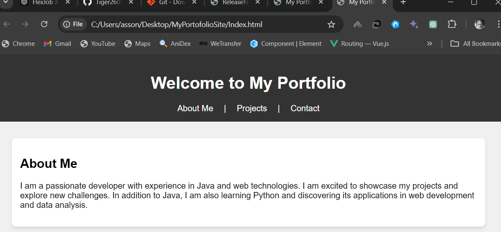
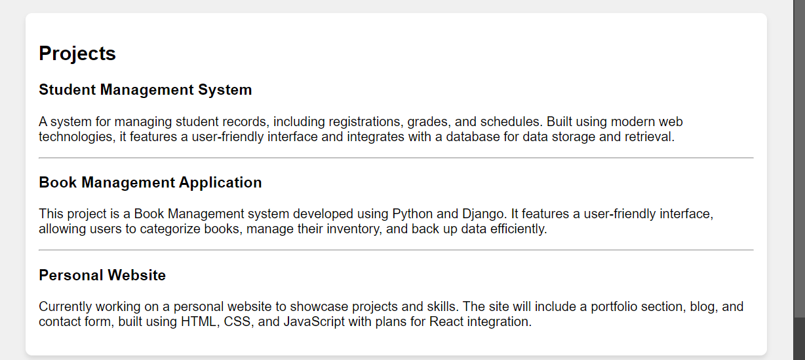

# My Portfolio

Welcome to my personal portfolio website, where I showcase my web development skills and projects. The site includes sections for an introduction, notable projects, and a contact form for inquiries.

## Features
1. **About Me**: Learn about my background in programming and development journey.
2. **Projects**:
   - **Student Management System**: Manages student records like grades and schedules.
   - **Book Management Application**: Built with Python and Django for book categorization and inventory.
   - **Personal Website**: Demonstrates web development skills.
3. **Contact**: Form for reaching out directly.

## Technologies Used
- HTML, CSS, JavaScript
- Python, Django
- Font Awesome for icons

## Installation
1. Clone the repository:
   ```bash
   git clone https://github.com/Tiger2605/Portofolio.git
2. Open 'index.html' in a browser

## Screenshots




## License
This project is licensed under the MIT License - see the [LICENSE](LICENSE) file for details.
